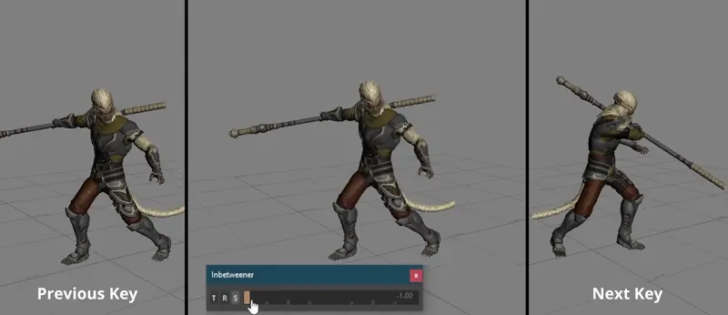

# MotionBuilder In-Betweener
Tool for Autodesk MotionBuilder to help create inbetween keyframes on the selected objects/character

  
*Rig: [Paragon: Wukong](https://www.fab.com/listings/27054d0c-c26e-4fe3-b6f9-fa778dfcb8b6)*

## Features
* Hold down <kbd>ctrl</kbd> to snap between 0.25, 0.5, 0.75 etc.
* Hold down <kbd>shift</kbd> for more granual control
* Double click the slider handle to manually type in a value

The tool takes your Keying Mode into consideration, e.g. Body Part only affects the active body part(s).

## Options
Use the buttons T = Translation, R = Rotation, S = Scale, to toggle what the inbetween should affect

Right click anywhere on the slider to bring up a context menu with additional options:

### Blend from current pose
On: Blends from the current pose to the neighboring keyframes  
Off: Creates the absolute inbetween between the previous and next keyframe

### Allow overshoot
If checked you can overshoot the pose by dragging the slider beyond it's max values


## Installation & Usage

Installation using pip:
```
pip install git+https://github.com/nils-soderman/motionbuilder-inbetweener
```

Create/show the tool by running:
```python
import motionbuilder_inbetweener
motionbuilder_inbetweener.show_tool()
```


## Issues
If you have any questions, suggestions or run into any issues, please [open an issue](https://github.com/nils-soderman/motionbuilder-inbetweener/issues "GitHub issues") on the GitHub repository
